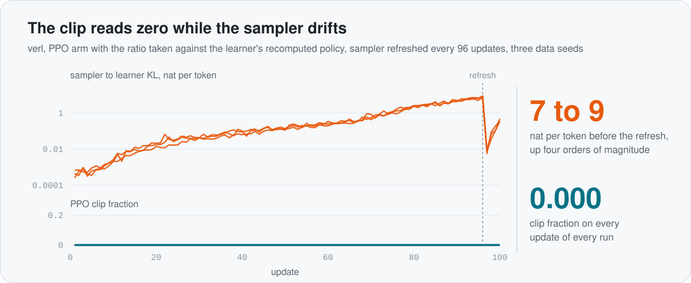
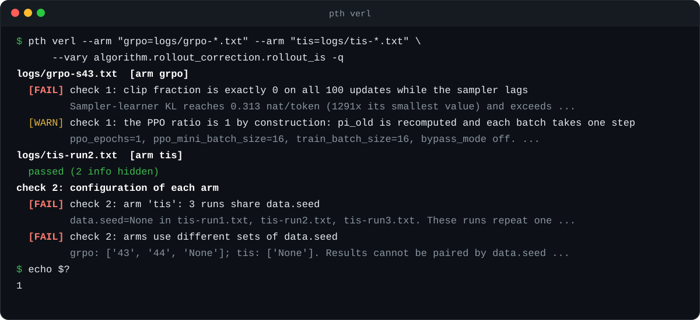
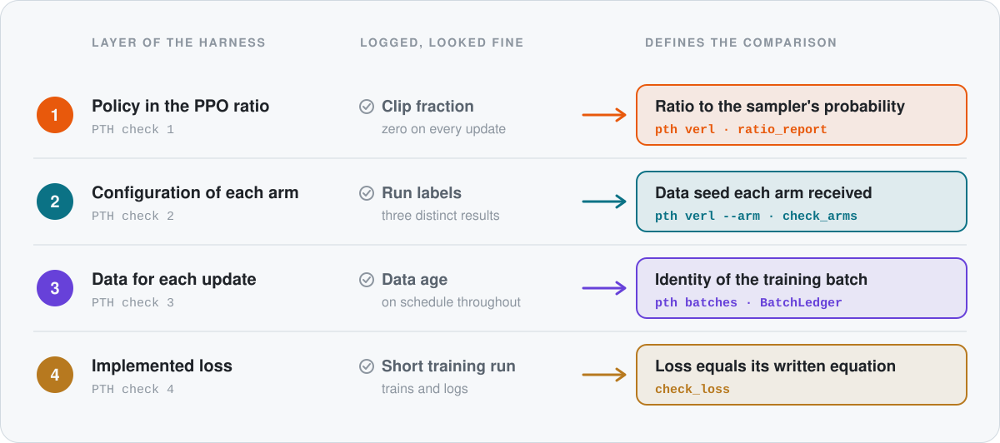

<picture>
  <source media="(prefers-color-scheme: dark)" srcset="assets/hero-dark.svg">
  
</picture>

<p align="center">
  <a href="https://arxiv.org/abs/2610.02911"></a>
  <a href="https://github.com/pth2002/probe-the-harness/actions/workflows/tests.yml"></a>
  
  <a href="LICENSE"></a>
</p>

<h3 align="center">Clip fraction 0.000. Sampler drift 10,000×. Your logs called it a calm run.</h3>

<p align="center">
  <a href="#quick-start">Quick start</a> &nbsp;·&nbsp;
  <a href="#four-layers-four-checks">Four layers</a> &nbsp;·&nbsp;
  <a href="#python-api">Python API</a> &nbsp;·&nbsp;
  <a href="CHECKLIST.md">Checklist</a> &nbsp;·&nbsp;
  <a href="#reference-results-on-verl">Reference results</a> &nbsp;·&nbsp;
  <a href="#citation">Citation</a>
</p>

A new method beat its importance-corrected baseline in every setting we ran. Then we probed the harness, the code that delays the sampler, builds each arm's configuration, picks the data for each update and computes each loss. Four details had shaped the result, and every one of them hid behind a log that looked fine.

- **The Idle Clip.** The PPO ratio pointed at the learner's own recomputed policy, so the clip never fired.
- **The Lost Seed.** The data seed never reached one arm, so its three runs replayed one data order.
- **The Stuck Batch.** A replay queue served its first batch for 33 updates in a row.
- **The Rogue Normaliser.** A loss divided by a different normaliser than its equation.

With the harness checked, the clean sweep on verl became a tie. **PTH turns those four lessons into checks you can run on your own comparison.** Two of them read the verl logs you already have. The other two take one line of logging or one short test.

## A log that looked right

<picture>
  <source media="(prefers-color-scheme: dark)" srcset="assets/signal-dark.svg">
  
</picture>

Here is the Idle Clip in a real verl run. The PPO arm logged a clip fraction of 0.000 on every update, which reads like a calm, healthy run. Over the same updates the sampler drifted four orders of magnitude away from the learner. The ratio was taken against the learner's own recomputed probabilities, so the clip had nothing to act on and the arm trained with no off-policy correction at all. **PTH check 1 spots this from a single verl console log.**

## Quick start

**Check your last run in one command.**

```bash
pip install git+https://github.com/pth2002/probe-the-harness
pth verl path/to/run.log
```

To compare arms, tell `pth` which run belongs to which arm:

```bash
pth verl --arm "grpo=logs/grpo-*.txt" --arm "tis=logs/tis-*.txt" \
         --vary algorithm.rollout_correction.rollout_is -q
```



Six console logs from the report, one command, two of the four caught in plain sight: the Idle Clip in every GRPO run and the Lost Seed in the TIS arm. `pth` exits with status 1 whenever a check fails, so it can stand guard over a results table in CI.

The core needs only numpy and Python 3.9 or newer. For check 4 (PyTorch) and YAML configs:

```bash
pip install "probe-the-harness[all] @ git+https://github.com/pth2002/probe-the-harness"
```

The verl reader needs `trainer.logger` to include `console` and `actor_rollout_ref.rollout.calculate_log_probs=True`. [docs/verl.md](docs/verl.md) shows how to run check 1 inside the update and how to save configurations and data orders for check 2.

## Four layers, four checks

Every layer of a harness has a quantity that everyone logs and a quantity that actually decides the comparison. PTH measures the second one and calls out what it finds by name.

<picture>
  <source media="(prefers-color-scheme: dark)" srcset="assets/layers-dark.svg">
  
</picture>

> [!TIP]
> **One principle.** For every layer of the harness, measure the quantity that defines the comparison, alongside the quantities that are convenient to log.

Checks 5 to 7 carry the same principle to the comparison as a whole: map each baseline's stable range, report paired differences per seed, and review code and logs against each claim. [CHECKLIST.md](CHECKLIST.md) lists all seven with the signal each one looks for.

## Python API

Every check returns a `Report`: findings at three levels (`fail`, `warn`, `info`) plus the statistics behind them. `report.ok` is false when any finding fails, and `report.raise_on_fail()` turns that into an exception. A finding that matches one of the four carries its name in `finding.tag`: `pth.IDLE_CLIP`, `pth.LOST_SEED`, `pth.STUCK_BATCH` or `pth.ROGUE_NORMALISER`.

<details>
<summary><b>Check 1</b> &nbsp; policy in the PPO ratio</summary>

```python
import pth

# Inside the update, per micro-batch. In verl: verl/workers/actor/dp_actor.py
rep = pth.ratio_report(log_prob, rollout_log_probs, response_mask, logp_old=old_log_prob)
rep.stats["kl_sampler_to_old"]          # KL(sampler || pi_old), nat per token
rep.stats["ratio_to_sampler"]["p99"]    # 99th percentile of pi_theta / q

# From logged series, any framework
rep = pth.scan_clip_vs_kl(clip_fraction_by_update, kl_by_update)
```
</details>

<details>
<summary><b>Check 2</b> &nbsp; configuration of each arm</summary>

```python
configs = {run: pth.load_config(f"{run}/resolved_config.yaml") for run in runs}
rep = pth.check_arms(configs, arm_of=lambda run: run.split("-")[0],
                     vary=["algorithm.rollout_correction.rollout_is"],
                     replicate=["data.seed"])

# Runs launched with different seeds should see different data orders
rep = pth.check_data_orders({run: pth.data_order_fingerprint(first_prompt_ids[run]) for run in runs},
                            seeds=launch_seeds)
```
</details>

<details>
<summary><b>Check 3</b> &nbsp; data for each update</summary>

```python
ledger = pth.BatchLedger()
for update in range(num_updates):
    batch, age = queue.next()
    ledger.record(update, pth.batch_fingerprint(batch["input_ids"]), age=age)
print(ledger.report(expected_age=lambda u: min(u, k)))
```

```text
check 3: data for each update
  [FAIL] check 3 (Stuck Batch): 32 of 100 updates reuse an earlier batch
         100 updates trained on 68 distinct batches. Updates 0 to 32 all trained on one batch ...
  [INFO] check 3: data age follows the design on every update
```
</details>

<details>
<summary><b>Check 4</b> &nbsp; implemented loss</summary>

```python
rep = pth.check_loss(my_loss, written_equation, pth.random_batch(), wrt=["logp"])
```

```text
  [FAIL] check 4 (Rogue Normaliser): loss: gradient with respect to logp differs from the equation
         max abs difference 0.017. Within every sequence the gradients point the same way, with a
         per-sequence factor between 0.6897 and 1.379. The two differ in a normaliser.
```
</details>

<details>
<summary><b>Check 6</b> &nbsp; paired differences per seed</summary>

```python
rep = pth.paired_differences({"tis": {43: .785, 44: .808}, "grpo": {43: .778, 44: .777}},
                             "tis", "grpo", scale=100)
# mean +1.9 over 2 seeds, range +0.7 to +3.1
```
</details>

Runnable versions of checks 3 and 4:

```bash
python examples/replay_queue.py       # a warm-up queue reuses batch 0 for 33 updates at the designed data age
python examples/loss_vs_equation.py   # a batch token mean against a per-response mean, found as a normaliser
```

## Reference results on verl

Correctly configured TIS and uncorrected GRPO under sampler lag, from the report: Qwen2.5-Math-1.5B on GSM8K, verl with vLLM 0.11, 16 prompts and 8 responses per update, 512 response tokens, AdamW at 2e-6, KL penalty 1e-3 to the initial model, one optimiser step per batch, 100 updates. The learner's weights reach the sampler on every N-th update only. Final greedy accuracy on the 1319 test problems, by data seed.

| | N = 64, default | 43 | 44 | N = 96, default | 43 | 44 |
|---|:-:|:-:|:-:|:-:|:-:|:-:|
| Uncorrected GRPO | .743 | .778 | .777 | .114 | .280 | .099 |
| TIS | .763 | .785 | .808 | .764 | .781 | .785 |

TIS uses `algorithm.rollout_correction.rollout_is=token` with `rollout_is_threshold=2.0`, which multiplies the loss by the detached weight min(pi_old / q, 2) with q the sampler's recorded probability. It stays stable over all 100 updates at both intervals. The uncorrected arm is verl's PPO loss with `ppo_epochs=1` and one mini-batch per batch, where the ratio is 1 and the clip cannot act. Use these numbers as a yardstick: if your own TIS baseline falls apart in this setting, run checks 1 to 4 before you blame the method.

## Probe your harness before a reviewer does

Run `pth verl` on the logs behind your next results table. If it stays quiet, ship the table. If it names an Idle Clip or a Lost Seed, you just saved yourself a rebuttal.

## Development

```bash
git clone https://github.com/pth2002/probe-the-harness && cd probe-the-harness
pip install -e ".[all,test]" && pytest
```

## Citation

```bibtex
@misc{pan2026probe,
  title         = {Probe the Harness: Setup Checks for Stale-Data {RL} Comparisons in Language Models},
  author        = {Pan, Taiheng},
  year          = {2026},
  eprint        = {2610.02911},
  archivePrefix = {arXiv},
  primaryClass  = {cs.LG},
  doi           = {10.48550/arXiv.2610.02911}
}
```

## License

MIT
